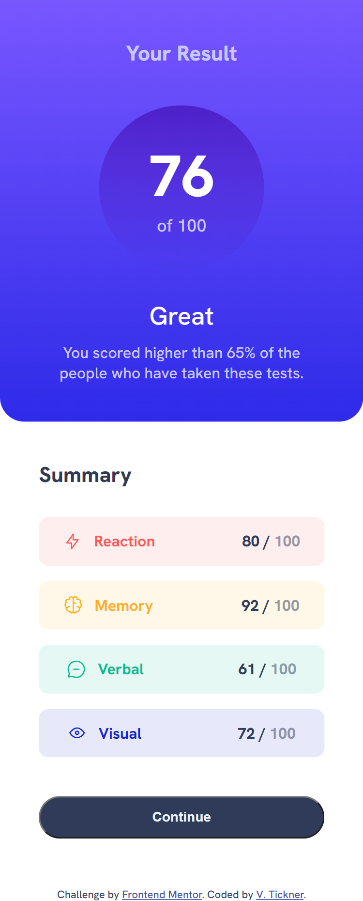
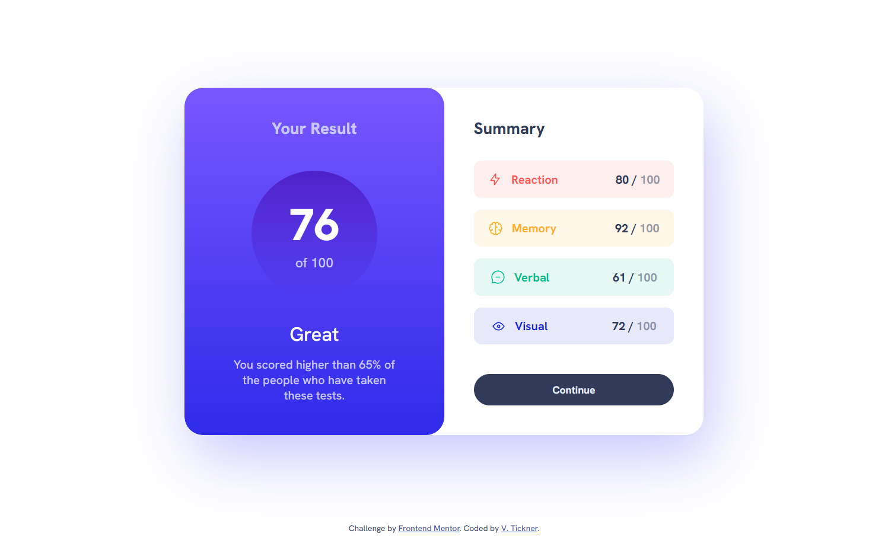

# Frontend Mentor - Results summary component solution

This is a solution to the [Results summary component challenge on Frontend Mentor](https://www.frontendmentor.io/challenges/results-summary-component-CE_K6s0maV).

## Table of contents

- [Overview](#overview)
  - [Screenshot](#screenshot)
  - [Links](#links)
- [My process](#my-process)
  - [Built with](#built-with)
  - [What I learned](#what-i-learned)
  - [Continued development](#continued-development)
  - [Useful resources](#useful-resources)
- [Author](#author)

## Overview

The challenge was to build a responsive layout to show a score summary card component and get the design to look as close as possible to the provided design images. It also included using a hover state for the button.

**Bonus**: On this challenge there was an extra bonus challenge to use the local JSON data to dynamically populate the summary data content.

### Screenshot





### Links

- Solution URL: [https://github.com/VTickner/frontend-mentor-results-summary-component](https://github.com/VTickner/frontend-mentor-results-summary-component)
- Live Site URL: [https://vtickner.github.io/frontend-mentor-results-summary-component/](https://vtickner.github.io/frontend-mentor-results-summary-component/)

## My process

- Created semantic HTML first
- Created CSS selectors to:
  - create custom variables to contain the various colours used in the design
  - used a CSS reset
  - layout the design using Grid and Flexbox
  - style the various elements, adding in a hover state for the button
  - added in `:focus` styling for accessibility purposes
  - create a different width layout for mobile version turning the card component into a column
- I didn't see the bonus challenge till at the end of completing the results summary card component. So the JavaScript was created last and used to read the data from the JSON file and replicate the HTML content that I had previously created.

### Built with

- Semantic HTML markup
- CSS custom properties
- Grid
- Flexbox
- Desktop-first workflow (responsive design)
- Google Font
- JavaScript

### What I learned

I learned how to read data from a JSON file and gained extra practice in creating content to add to the DOM.

```js
fetch("data.json")
  .then((response) => response.json())
  .then((data) => {
    data.forEach((obj) => {
      const value = obj.value;
    });
  });
```

I learnt how to add content to the DOM between elements in the HTML file, by using:

```js
parentElement.insertBefore(
  elementToInsert,
  parentElement.querySelector(".beforeElement")
);
```

### Continued development

To gain more practice reading from a file and learn how to write to a file, as well as extra practice using the DOM.

### Useful resources

- [Google Fonts](https://fonts.google.com/) - The font used in this design was [Hanken Grotesk](https://fonts.google.com/specimen/Hanken+Grotesk).

## Author

- Frontend Mentor - [@VTickner](https://www.frontendmentor.io/profile/VTickner)
